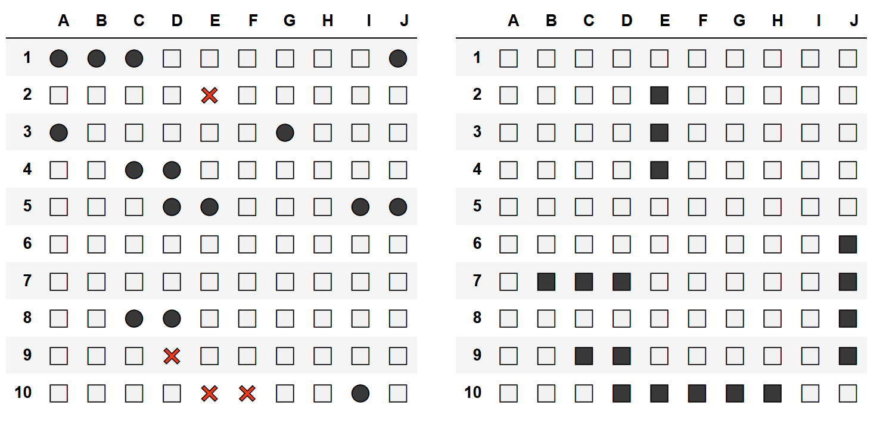

# gym-battleship-LLM

バトルシップ環境をOpenAI環境ツールキットを使用して実装し、LLMガイドによる強化学習戦略の蒸留研究に拡張したものです。

## プロジェクト概要: Strategy Distillation in RL via LLM-Guided Interpretation

このリポジトリは、**強化学習における戦略蒸留をLLMガイド解釈によって行う**フレームワークを実装します。バトルシップゲーム環境をケーススタディとして使用しています。

主な特徴:
1. バトルシップゲームで高性能な強化学習エージェントを訓練
2. GPT-4oを使用してプレイ軌跡にLPML（LLM-Prompting Markup Language）で注釈付け
3. これらの戦略をより小さく解釈可能なポリシーに蒸留
4. 標準タスクと転移タスクでの性能評価

## プロジェクト構造

```
.
├── expert/                 # エキスパートRL エージェントの訓練
│   ├── train_expert.py     # PPOエキスパートエージェントの訓練
│   └── collect_trajectories.py  # エキスパートのゲームプレイ記録
├── lpml/                   # LLM注釈付け
│   └── annotate.py         # GPT-4oによるLPML注釈生成
├── distill/                # ポリシー蒸留
│   └── train_student.py    # 学生ポリシーの訓練
├── eval/                   # 評価
│   └── run.py              # 結果の評価と分析
├── trajectories/           # 保存された軌跡（実行時に作成）
├── test_env_simple.py      # 環境の簡易テスト
└── run_experiment.sh       # すべての実験フェーズを実行するメインスクリプト
```

## セットアップ

1. Conda環境を作成:
```bash
conda create -n distill python=3.9
conda activate distill
```

2. 必要なパッケージをインストール:
```bash
pip install gymnasium stable-baselines3 torch tqdm matplotlib
pip install ipython  # 環境レンダリング用
pip install openai   # GPT-4o API用
```

3. バトルシップ環境をインストール:
```bash
cd gym-battleship-LLM
pip install -e .
cd ..
```

4. GPT-4o注釈のためにOpenAI APIキーを設定:
```bash
export OPENAI_API_KEY="your-api-key-here"
```

## 実験の実行

実験全体は提供されたシェルスクリプトで実行できます:

```bash
chmod +x run_experiment.sh
./run_experiment.sh
```

このスクリプトは各フェーズを順に実行し、必要に応じてフェーズをスキップすることもできます:

1. **エキスパートエージェントの訓練**: 高性能（勝率95%以上）のPPOエージェントを訓練
2. **軌跡の収集**: 分析用に1000ゲームエピソードを記録
3. **LPMLによる注釈付け**: GPT-4oを使用して構造化されたゲーム戦略注釈を生成
4. **学生ポリシーの訓練**: 2種類の蒸留モデルを訓練
   - 戦略教師付きポリシー（LPMLクラスターを使用）
   - KLダイバージェンスポリシー蒸留
5. **モデル評価**: 標準タスクと転移タスクでのパフォーマンスをテスト

## 個別フェーズの実行

各フェーズは個別に実行することもできます:

```bash
# フェーズ1: エキスパート訓練
python expert/train_expert.py --total-timesteps 1000000 --seed 42 --save-path expert/best.zip

# フェーズ2: 軌跡収集
python expert/collect_trajectories.py --model expert/best.zip --episodes 1000 --out trajectories/battleship.pkl

# フェーズ3: LPML注釈付け
python lpml/annotate.py --traj trajectories/battleship.pkl --out lpml/battleship.xml --n_candidates 3

# フェーズ4A: 戦略モデル
python distill/train_student.py --lpml lpml/battleship.xml --model-type strategy --out distill/student_strategy.pth --epochs 10

# フェーズ4B: KL蒸留
python distill/train_student.py --teacher expert/best.zip --model-type kl --out distill/student_kl.pth --epochs 10

# フェーズ5: 評価
python eval/run.py --agent distill/student_strategy.pth --episodes 500
python eval/run.py --agent distill/student_strategy.pth --variant large_grid --episodes 500
```

## 結果

評価結果は `eval/results` ディレクトリに保存され、以下が含まれます:
- 詳細なメトリクスを含むJSONファイル
- パフォーマンス分布を示すプロット
- 勝率と平均ゲーム長

## 実装メモ

- 観測空間は命中/ミス状態を表す2チャンネルグリッド
- アクションはグリッド上の(x,y)座標
- 報酬設計: 命中+1、船沈没+3、勝利+10
- LPML注釈は `<Condition>`、`<Thought>`、`<Execution>` タグを含む
- 2種類の学生ポリシーで異なる蒸留アプローチを実証
- より大きなグリッド転移テストで一般化能力を評価

---

# バトルシップ環境の基本情報

## 基本

環境の作成と初期化:
```python
import gym
import gym_battleship
env = gym.make('Battleship-v0')
env.reset()
```

アクション空間と観測空間の取得:
```python
ACTION_SPACE = env.action_space.n
OBSERVATION_SPACE = env.observation_space.shape[0]
```

ランダムエージェントの実行:
```python
for i in range(10):
    env.step(env.action_space.sample())
```

隠れたゲーム状態の観察:
```python
print(env.board_generated)
```
## 有効なアクション

アクションを入力する方法は2つあります。  
1つ目はタプルをそのまま入力する方法:
```python
env = gym.make('battleship-v0')
env.reset()
action = (0, 0)
env.step(action)
```

2つ目はエンコードされたアクションを入力する方法:
```python
env = gym.make('battleship-v0')
env.reset()
action = 10
env.step(action)
```

## 環境のカスタマイズ

オリジナルのバトルシップゲームは10x10のグリッドでプレイされ、艦隊は5隻の船で構成されています: 空母（5マス）、戦艦（4マス）、巡洋艦（3マス）、潜水艦（3マス）、駆逐艦（2マス）。  

したがって、デフォルトのパラメータは:
```python
ship_sizes = {5: 1, 4: 1, 3: 2, 2: 1}
board_size = (10, 10)
```

環境を作成する際にパラメータを変更することが可能です:
```python
import gym
import gym_battleship

env = gym.make('battleship-v0', ship_sizes={4: 2, 3: 1}, board_size=(5, 5))
```

その他の可能なパラメータは、報酬やエピソードの最大ステップ数です:
```python
import gym
import gym_battleship

env = gym.make('battleship-v0', episode_steps=10, reward_dictionary={'win': 200})
```

デフォルトの報酬キーと値は以下の通りです:
```python
reward_dictionary = {
    'win': 100,
    'missed': 0,
    'touched': 1,
    'repeat_missed': -1,
    'repeat_touched': -0.5
}
```
編集したい報酬のみを環境に渡す必要があります。

## レンダリング

環境をレンダリングするための2つの関数が存在します:
```python
env.render_board_generated()
```
```python
env.render()
```
IPythonノートブックでのレンダリング例（左が `env.render()`、右が `env.render_board_generated()`）


<details>
    <summary>レンダリングのコードスニペット</summary>

        import gym
        import gym_battleship

        env = gym.make('battleship-v0')
        env.reset()

        for i in range(10):
            env.step(env.action_space.sample())
            env.render()

        env.render_board_generated()
        
</details>

残念ながら、IDEやコンソールのデータフレームの整形表示は、ノートブックで表示されるデータフレームほど美しくありません。

## 敵対的バトルシップ環境

### 概要
敵対的バトルシップ環境は、2つの強化学習エージェント間の戦いを目的とした環境です。
この環境は生成的敵対的アルゴリズム（GANs）にインスパイアされています。
1つのエージェントは防御側で戦略的に船を配置する目的があり、もう1つのエージェントは `Battleship-v0` 環境のように攻撃側の役割を持ちます。

### 基本

次のスクリプトは、2つのエージェントをトレーニングする方法を示しています:

```python
import gym
import gym_battleship
from collections import namedtuple

env = gym.make('AdversarialBattleship-v0')
step = namedtuple('step', ['state', 'reward', 'done', 'info'])

attacker_agent = env.attacker_action_space.sample
defender_agent = env.defender_action_space.sample

num_episodes = 1
for episode in range(num_episodes):

    defender_old_state = env.defender_reset()
    while True:
        defender_action = defender_agent()
        return_value = env.defender_step(*defender_action)
        if return_value:
            defender_step = step(*return_value)
            # defender_agent.learn(defender_old_state, defender_step.reward, defender_step.state, defender_step.done)
            defender_old_state = defender_step.state
        else:
            break

    attacker_step = step(*env.attacker_initialization(), False, {})
    env.render_board_generated()

    while not attacker_step.done:
        attacker_action = attacker_agent()
        attacker_step = step(*env.attacker_step(attacker_action))
        # defender_agent.learn(attacker_old_state, attacker_step.reward, attacker_step.state, attacker_step.done)
        attacker_old_state = attacker_step.state

    defender_step = step(*env.defender_step(*defender_action))
    # defender_agent.learn(defender_old_state, defender_step.reward, defender_step.state, defender_step.done)
```

最初に防御側が船を配置し、攻撃側のアクションを待つために `None` 値を受け取ります。その後、攻撃側は `Battleship-v0` のように行動します。最後に、防御側は報酬を受け取り、最後の学習ステップを実行できます。

レンダリングとカスタマイズは `Battleship-v0` 環境と同じです。

## 今後の予定

- ドキュメント文字列の記述
- エージェントが船の位置を選択できるようにするメソッドの作成

## インストール

リポジトリをpipでインストールするためのコマンドは:
```bash
pip install git+https://github.com/thomashirtz/gym-battleship#egg=gym-battleship
```
