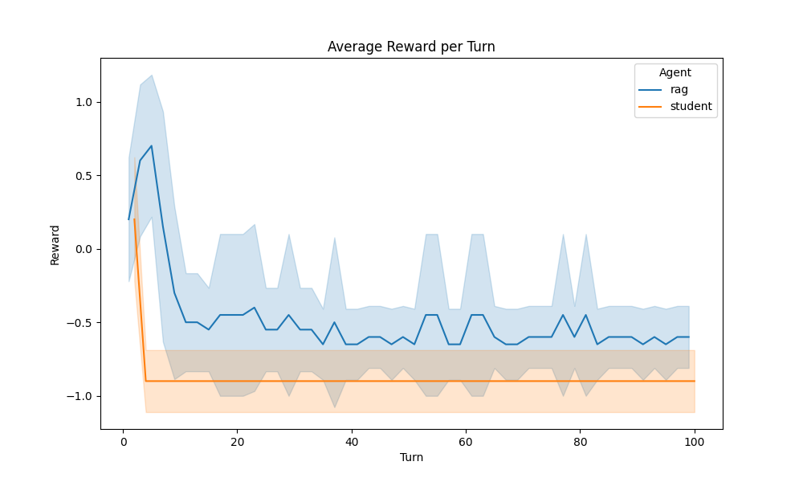
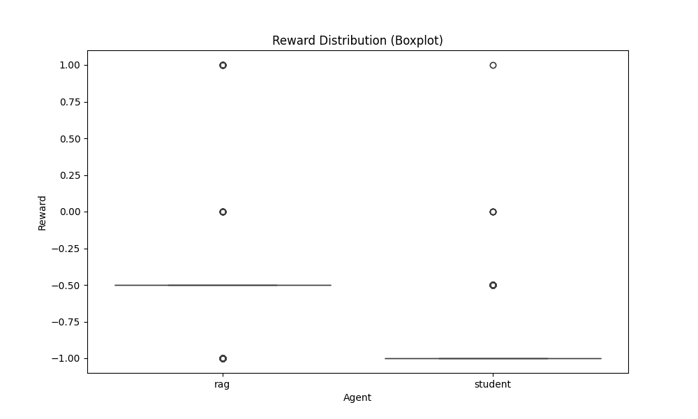
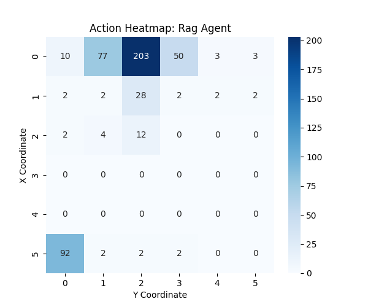
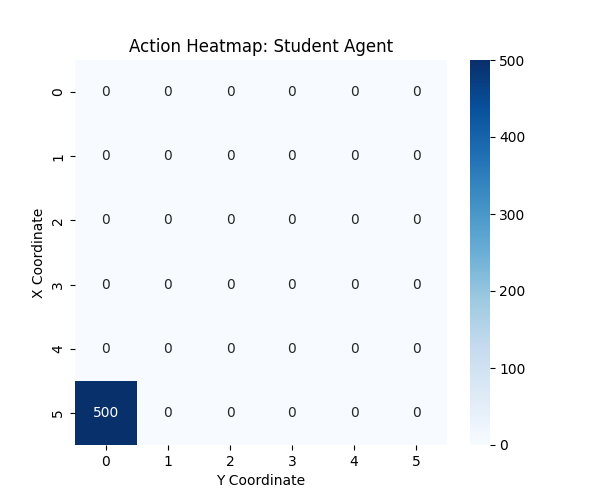
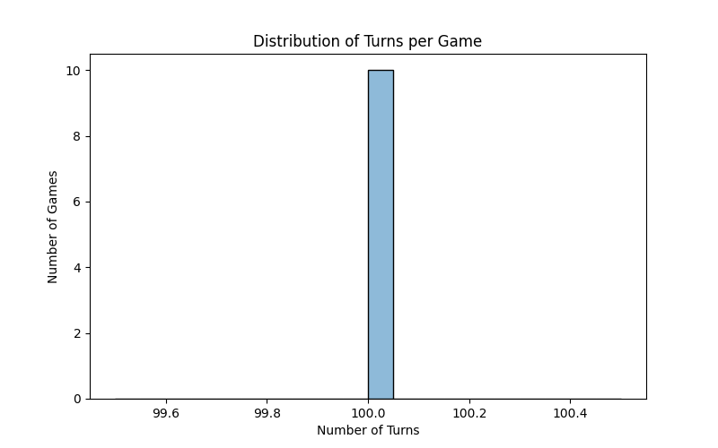

# figures ディレクトリのグラフ解説

このディレクトリには、`rag_vs_student_results.json` の解析結果として生成された各種グラフが保存されています。  
それぞれのグラフの内容と読み取りポイントを解説します。

---

## 1. reward_lineplot.png

**内容**:  
各エージェント（rag, student）のターンごとの報酬（reward）の平均推移を折れ線グラフで示しています。  
標準偏差（SD）もエラーバーとして表示しています。

**ポイント**:  
- 各エージェントがどのタイミングで高い報酬/低い報酬を得ているかが分かります。
- 学習の進み具合や戦略の違いを比較できます。

---

## 2. reward_boxplot.png

**内容**:  
各エージェントの全ターンの報酬分布を箱ひげ図で示しています。

**ポイント**:  
- 報酬の中央値・四分位範囲・外れ値を視覚的に比較できます。
- 安定して高い報酬を得ているか、ばらつきが大きいかが分かります。

---

## 3. reward_violinplot.png

**内容**:  
各エージェントの報酬分布をバイオリンプロットで示しています。

**ポイント**:  
- 箱ひげ図よりも分布の形状（多峰性・裾野の広がりなど）が分かりやすいです。

---

## 4. action_heatmap_rag.png

## 5. action_heatmap_student.png

**内容**:  
各エージェントが盤面上のどの座標（x, y）をどれだけ選択したかをヒートマップで示しています。

**ポイント**:  
- よく狙う場所・偏り・探索パターンの違いが一目で分かります。
- 戦略の特徴や癖を可視化できます。

---

## 6. hit_rate_barplot.png

**内容**:  
各エージェントのヒット率（reward > 0 となった行動の割合）を棒グラフで示しています。

**ポイント**:  
- 命中精度や効率性の比較ができます。
- 高いほど「当たり」を多く引いていることを意味します。

---

## 7. turns_per_game_hist.png

**内容**:  
1ゲームあたりのターン数（=ゲームの長さ）の分布をヒストグラムで示しています。

**ポイント**:  
- ゲームが早く終わる傾向か、長引く傾向かが分かります。
- エージェントの強さや戦略の違いがゲームの長さにどう影響するかを分析できます。

---

## まとめ

これらのグラフを活用することで、  
- エージェントごとの行動傾向
- 報酬の安定性や分布
- 命中率や効率性
- ゲーム展開の特徴

などを定量的・視覚的に比較・分析できます。
