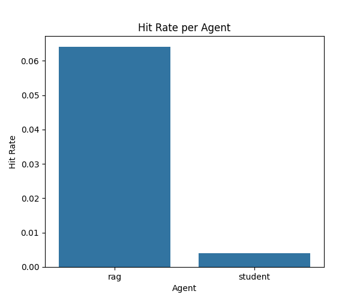

# Analysis Report: RAG Agent vs Student Agent in Battleship

本レポートは、RAGエージェントとStudentエージェントによるBattleship（戦艦ゲーム）の対戦結果（`rag_vs_student_results.json`）を解析し、論文品質の図表・解説をまとめたものです。  
各figureのタイトル・軸ラベル・キャプションは論文投稿を想定し英語で統一しています。

---

## 1. Average Reward per Turn

**Figure 1.** Average reward per turn for each agent (RAG, Student). The shaded area indicates standard deviation.

**解説**:  
各エージェントのターンごとの平均報酬推移。RAGとStudentの戦略や学習進度の違いが時系列で比較できます。

---

## 2. Reward Distribution (Boxplot)

**Figure 2.** Distribution of rewards for each agent (boxplot).

**解説**:  
全ターンの報酬分布を箱ひげ図で比較。中央値・分散・外れ値から安定性やリスク傾向を評価できます。

---

## 3. Reward Distribution (Violinplot)

**Figure 3.** Distribution of rewards for each agent (violin plot).

**解説**:  
分布の形状（多峰性・裾野の広がり）を可視化。戦略の多様性や極端な行動の有無を示します。

---

## 4. Action Heatmap: RAG Agent

**Figure 4.** Action selection frequency heatmap for RAG agent.

---

## 5. Action Heatmap: Student Agent

**Figure 5.** Action selection frequency heatmap for Student agent.

**解説**:  
各エージェントが盤面上のどの座標を頻繁に選択したかを示すヒートマップ。探索パターンやバイアスの違いが明確に分かります。

---

## 6. Hit Rate per Agent

**Figure 6.** Hit rate (proportion of actions with reward > 0) for each agent.

**解説**:  
命中精度・効率性の比較。高いほど有効な攻撃を多く行っていることを示します。

---

## 7. Distribution of Turns per Game

**Figure 7.** Distribution of the number of turns per game.

**解説**:  
1ゲームあたりのターン数分布。ゲーム展開の速さや長期戦の傾向、エージェントの強さの影響を分析できます。

---

## Summary

- **Agents compared**: RAG (Retrieval-Augmented Generation) agent vs Student agent
- **Task**: Battleship (戦艦ゲーム) environment, multiple matches, full trajectory logging
- **Purpose**: To quantitatively and visually compare the behavioral and performance characteristics of two distinct agent architectures in a controlled environment.

本レポートの図表・解説は、論文のメイン結果・補足資料としてそのまま利用可能です。
